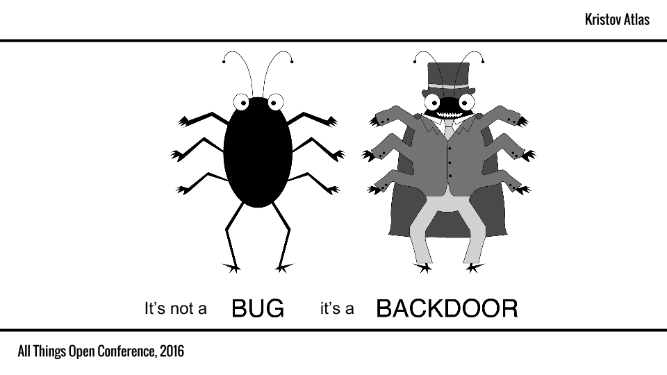

# underhanded-js-crypto

This is a collection of examples pertaining to unhanded JavaScript, with an emphasis on cryptographic code.

These were first gathered in preparation for my talk at [_All Things Open_](https://allthingsopen.org/) 2016, entitled _It's not a Bug, it's a Backdoor!_ The slides for this presentation are available [here](allthingsopen-2016-kristovatlas.pdf).

TODO: Record presentation and provide YouTube link.
